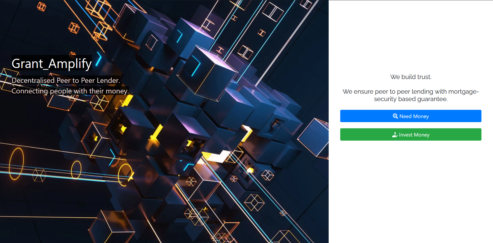
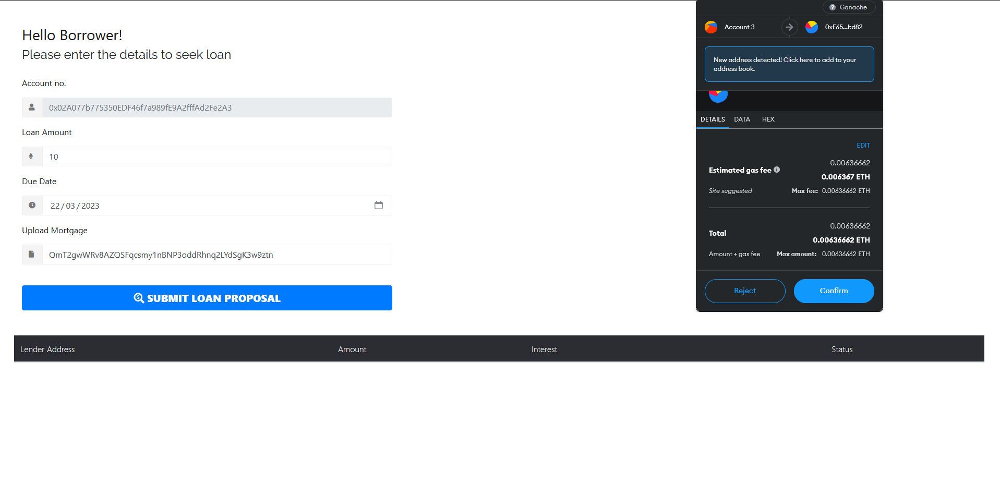
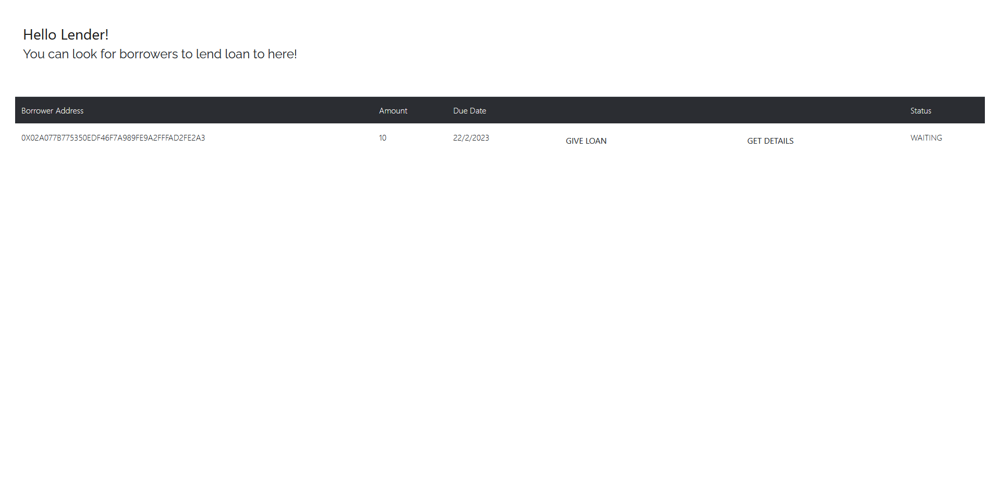
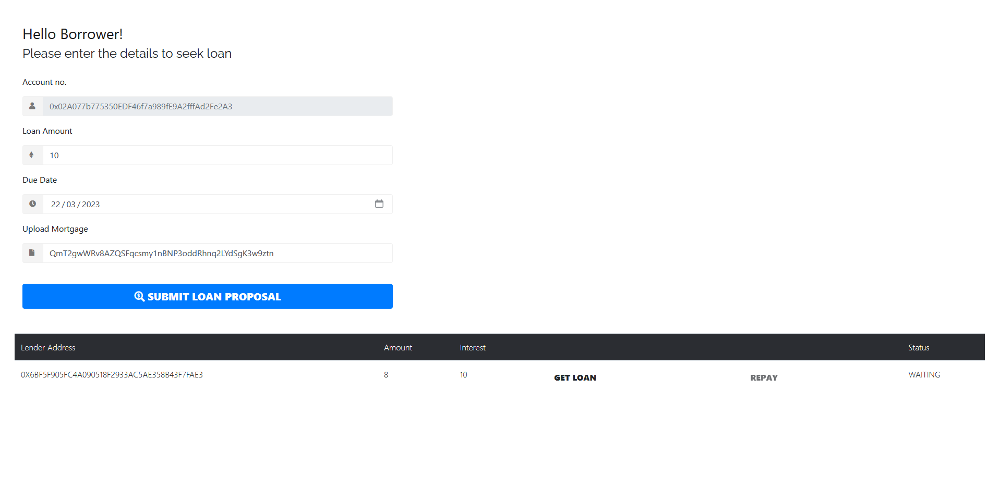
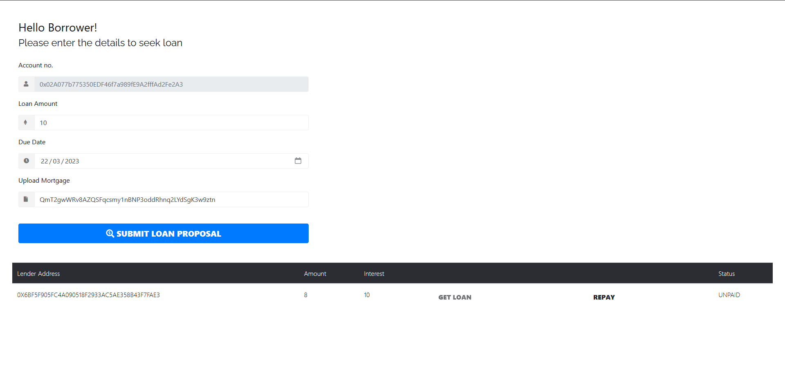

# Grant_Amplify

### Grant_Amplify is a blockchain-based peer-to-peer lending platform that allows ordinary people to obtain loans without the inconvenience of dealing with banks or local lenders, and eliminates the cumbersome screening and paperwork procedures. :moneybag:

        

Table of Contents
 
<ol>
 <li>
 <a href="#problem-statement">Problem Statement</a>          
 </li>
  <li>
 <a href="#proposed-solution">Proposed Solution</a> 
   </li>
 <li>  
   <a href="#project-design">Project Design</a>     
 </li>       
 <li>
   <a href="#features">Features</a>
</li>
<li>
<a href="#video-demonstration">Video Demonstration</a>
</li>
 <li>         
   <a href="#technologies-used">Technologies Used</a>       
 </li>
 <li>         
   <a href="#next-steps">Next Steps</a>       
 </li>                 
 </ol>         
 
         
          
   
       
          
   # Problem Statement
   
   There are two main parties who provide loans to people, those are -:
   
   ## Banks :bank:
   *   Banks provide loans at a very high interest rate and they have a very lenghty and biased screening process. 
   *   Following the 2008 recession, obtaining loans has become even more challenging due to the widespread issue of people being unable to repay the loans they received, and the inability to sell their properties due to the properties' plummeting value. 
   *   Banks are hesitant to take on risks and often exhibit biases based on factors such as caste, religion, financial background, among others.
   ## Lenders :money_mouth_face:
   *   Lenders take high and unfair rates of interest where the entire power lies in their hands and leaves the borrowers vulnerable to exploitation. 
   *   The lenders hold the authority to raise the interest rate beyond the initially agreed upon amount at a later stage.
    
  

   
   # Proposed Solution :bulb:
   
   Grant_Amplify overcomes all these complications by providing a decentralised system of peer-to-peer lending where no single entity has the whole power and is able to harness the full potential of Web 3.0 by offering the following advantages -:
   * **Transparency :** The whole process is decentralised where neither of the parties has all of the power. The platform connects the borrower directly to the lender and there is no middleman involved.
   *  **Immutability :** Since blockchain is immutable, the interest rate once decided upon cannot be changed later in any unfair manner. Prior to lending, the lender determines the desired interest rate, whilethe borrower selects an interest rate from those presented by various lenders.
   *  **Security :** Blockchain also eliminates the concern of lenders regarding loan repayments. In case the borrower fails to repay the loan by the stipulated due date, the lenders can seize the mortgage submitted by the borrower and auction it off.
    
          
 
         
          
  # Project Design :art:
 

        

          
 
         
          
  # Features :scroll:        
 
 > As of now we are using a decentralised public IPFS gateway. To use our DApp generate your file CID [here](https://www.dreamlink.cloud/) before adding it as a mortgage.
 
 <ol>
          
  * Prospective borrowers have the flexibility to formulate their loan proposal by specifying their desired loan amount, preferred repayment date, and uploading the CID of their mortgage onto IPFS.
  
           
          
  * Lenders have the ability to verify the borrower's information and submit their loan proposal along with a favourable interest rate. 
  
    
    
  * Subsequently, if the borrower finds the interest rate acceptable, they can proceed to accept the loan offer.   
    
    
    
  * Once again at the lender page, once the confirmation from the borrower has arrived, the funds can be disbursed from the lender's account to the borrower's account.
    
    
    
    
  * At the lender's end, upon receiving confirmation from the borrower, the funds can be disbursed from the lender's account to the borrower's account. 
  
      

</ol>

   
   

   
   # Video Demonstration :movie_camera:
   
   Demonstration of our Dapp is added to [this link](https://youtu.be/Zri5jPWQoEk)
   
          
   
       
   
   # Technologies Used :computer:
   
1. Ethereum 
2. Solidity
3. Truffle
4. MetaMask
5. JavaScript
6. Ganache
7. Web3
8. jQuery
 
  
  
 
 # Next Steps :feet:
 
 * One potential solution to address scalability concerns is to explore the integration of conventional fiat currencies alongside cryptocurrency. This would offer users the option to utilize different forms of mainstream currency, thus providing greater flexibility and accessibility for a wider range of users
 * Improving UI/UX of the website
 * Credit system for the future so that mortgage may not be necessary for future repayments
 * Having an more robust manner to verify the mortgages
 
 ------       
 
 ### Made with <3 by
 
[Riya Sisodia](https://github.com/Rrs-4817)
:smirk:

[Zuber Rahman](https://github.com/zuberrahman)
:prince:

       
        
          
          
          

